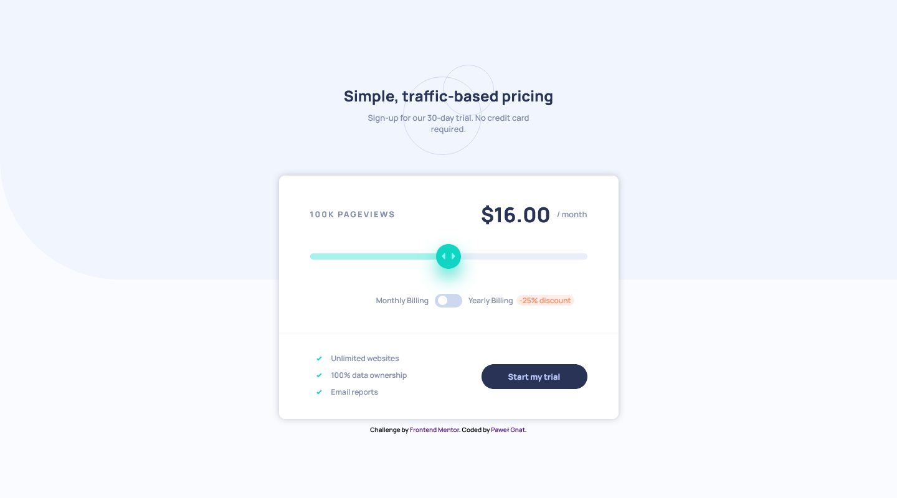

# Frontend Mentor - Interactive pricing component solution

This is a solution to the [Interactive pricing component challenge on Frontend Mentor](https://www.frontendmentor.io/challenges/interactive-pricing-component-t0m8PIyY8). Frontend Mentor challenges help you improve your coding skills by building realistic projects. 

## Table of contents

- [Overview](#overview)
  - [Screenshot](#screenshot)
  - [Links](#links)
- [My process](#my-process)
  - [Built with](#built-with)
  - [What I learned](#what-i-learned)
- [Author](#author)

## Overview

### Screenshot

### Links

- Live Site URL: [Frontend Mentor Interactive pricing component](https://pawel-gnat.github.io/Frontend-Mentor-Interactive-pricing-component/)

## My process

I had to insert my arrays data inside text areas while sliding through my range input. Another input (checkbox type) toggle my price and insert new discounted value in same areas as before. 

### Built with

- Semantic HTML5 markup
- CSS custom properties
- Flexbox
- Mobile-first workflow
- JavaScript

### What I learned

Challenge done within 10 hours. I learned what a clamp() is, very useful! I also tried to style my range input in different browsers, but I did it well only on firefox browser. I think it's not supported in all browsers by using css. I had a chance to work with 2 JS data arrays and use a switch statement. 

## Author

- Frontend Mentor - [@Pawel-Gnat](https://www.frontendmentor.io/profile/Pawel-Gnat)
